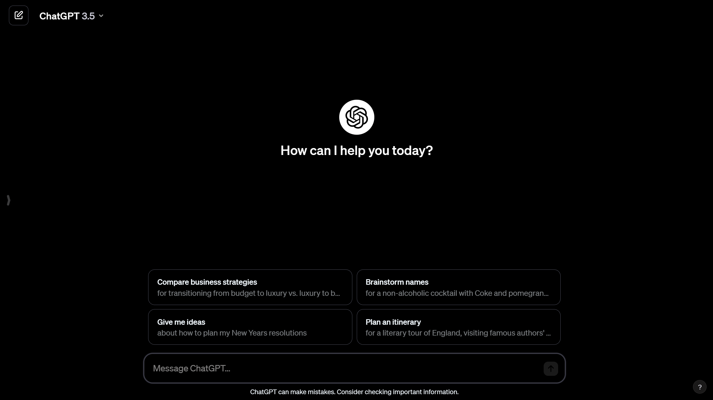

## Description

ChatGPT-UI-changer-extension is a web browser extension that allows you to change the UI design of ChatGPT to pure black amoled theme.

## Features

-   Modifies the UI elements of ChatGPT to provide a customized user experience.
-   Integrates with the ChatGPT interface seamlessly.

## Installation

1. Clone the repository or download the extension files.
2. Open your web browser and navigate to the extensions page.
3. Enable developer mode.
4. Click on "Load unpacked" and select the extension directory.

## Usage

-   Once installed, the extension will automatically modify the UI of ChatGPT when accessed through the web browser.

## Contributing

Please feel free to contribute to the development of this extension by submitting pull requests.
